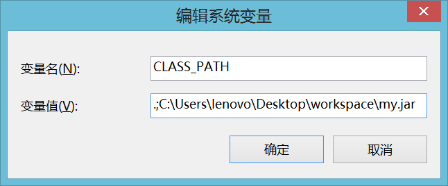

## 包的定义及使用

---

1、对于面向对象核心的概念：类、接口、抽象类、对象，到此为止所有主体结构的代码都已讲解完成；

2、包的定义及使用；

3、系统包的介绍；

4、jar命令的操作。

### 包的定义

包指的是一个程序的目录，在最早的时候如果要开发一个程序，只需要定义一个*.java文件，而后在这个文件里编写所需要的类文件，而在编译之后程序将直接保存在根目录下，而利用包可以实现同一个程序的拆分，即：根据要求将代码保存在不同的目录下。

如果要定义包可以使用package关键字完成。

**范例：** 定义包

```java
package com.alpha.frist;
public class MainClass {
	public static void main(String[] args) {
		System.out.println("Hello World!");
	}
}
```

如果定义包的时候出现了“.”，那么就表示子目录。如果说类有包的定义，那么就必须让其保存在特定的目录下，只不过不要自己去手工创建这些目录，应该使用命令自动生成；

* 打包编译：javac -d . MainClass.java
  * "-d"：表示根据package的定义生成目录；
  * "."：表示保存的路径，"."表示当前目录；
* 在解释程序的时候不要进入包里面解释程序，应该在包外面输入类的完整名称（包.类）；
  * 输入：java com.alpha.frist.MainClass

以后所有的类都一定要定义在包之中，完整的类名称就是“包.类”。

### 包的导入

使用包可以将一个完整的程序拆分为不同的文件进行分别保存，这样就会造成一个问题，不同包之间有可能进行互相访问，那么此时就需要使用到导包操作，使用import关键字完成。

**范例：** 定义一个_com.alpha.util_.Message的类

```java
package com.alpha.util;
class Message {
	public void print() {
		System.out.println("Hello World !");
	}
}
```

**范例：** 定义一个_com.alpha.test_.TestMessage的类，这个类要使用Message类

```java
package com.alpha.test;
import com.alpha.util.Message; // 导入要使用的类
public class TestMessage {
	public static void main(String[] args) {
		Message msg = new Message();
		msg.print();
	}
}
```

对于程序的编译应该采用先编译Message，而后再编译Message的顺序完成。

<table><tr><td>
javac -d . Message.java
</td></tr><tr><td>
javac -d . TestMessage.java
</td></tr><tr><td>
TestMessage.java:2: 错误: Message在com.alpha.util中不是公共的; 无法从外部程序包中对其进行访问
import com.alpha.util.Message; // 导入要使用的类
</td></tr></table>

**总结：**关于public class和class声明类的完成区别？

* public class：文件名称必须与类名称保持一致，在一个*.java文件里面只能够有一个public class声明，如果一个类需要被不同的包所访问，那么一定要定义为public class；
* class：文件名称可以与类名称不一致，并且一个*.java文件李曼可以有多个class定义，编译后会形成多个*.class文件，如果一个类使用的是class定义，那么这个类只能够被本包访问。

**范例：** 修改Message,java类的定义

```java
package com.alpha.util;
public class Message {
	public void print() {
		System.out.println("Hello World !");
	}
}
```

Java编译器考虑到了作为大型项目开发的时候有可能会存在有多个*.java文件互相引用的情况，为了解决这个问题，提供了通配符“*”操作：javac -d . *.java。

但是发现在导入包的时候也出现了一个问题：如果使用一个包中类的时候要编写“import 包.类”，如果说现在要使用一个包中多各类的时候，那么肯定要重复去编写“import 包.类”，这样是很麻烦的，所以此时可以使用“包.*”的方式来代替一个包中多个类的导入操作；

```java
package com.alpha.test;
import com.alpha.util.*; // 导入要使用的类
public class TestMessage {
	public static void main(String[] args) {
		Message msg = new Message();
		msg.print();
	}
}
```

使用“包.*”值得并不是全部导入，而是只导入程序里面所需要的类，所以不需要去考虑性能问题。

那么此时就会存在一个问题，有可能同一个类中要导入不同的包，并且这些不同的包中存在有同名类：

* com.alpha.util.Message;
* org.beta.test.Message;

由于某种需要，要同时导入以上两个包。

```java
package org.beta.test;
public class Message {
	public void get() {
		System.out.println("Hello Message !");
	}
}
```

对于TestMessage类，由于某种需求，同时需要导入两个包。

```java
package com.alpha.test;
// 这两个包里面都有同一个名称的类
import com.alpha.util.*; // 导入要使用的类
import org.beta.test.*;
public class TestMessage {
	public static void main(String[] args) {
		Message msg = new Message();
		msg.print();
	}
}
```

```java
TestMessage.java:7: 错误: 对Message的引用不明确
                Message msg = new Message();
                ^
  org.beta.test 中的类 org.beta.test.Message 和 com.alpha.util 中的类 com.alpha.util.Message 都匹配
TestMessage.java:7: 错误: 对Message的引用不明确
                Message msg = new Message();
                                  ^
  org.beta.test 中的类 org.beta.test.Message 和 com.alpha.util 中的类 com.alpha.util.Message 都匹配
2 个错误
```

那么在这种情况下为了可以明确的找到要使用的类，可以在使用类的时候加上包的名称。

```java
com.alpha.util.Message msg = new com.alpha.util.Message();
```

如果觉得导包操作会产生冲突，那么就在实例化对象的时候写上完整的类名称。

### 系统常见包

Java本身提供了大量的程序开发包（除了Java自己提供的，还有许多第三方提供的开发包）。在Java开发里面有如下一些常见的系统包：

* java.lang：包含String、Object、Integer等类，从JDK1.1开始此包自动导入；
* java.lang.reflect：反射开发包；
* java.util：Java的工具包，提供了大量的工具类；
* java.util.regex：正则工具包；
* java.text：国际化处理程序包；
* java.io：进行输入、输出处理以及文件操作；
* java.net：网络编程开发包；
* java.sql：数据库程序开发包；
* java.applet：Applet程序开发包（已经不用了）；
  * Applet指的是在网页上嵌套的程序，可以使用Applet做一些动态效果；

Applet是最早的Java出现的形式，功能类似于今天的JavaScript。

```java
package com.alpha.demo;
import java.applet.*;
import java.awt.*;
public class MyApplet extends Applet {
	public void paint(Graphics g) {
		g.drawLine(10, 10, 100, 100);
	}
}
```

编译之后并不能表示其可以正常的使用，还需要编写html代码进行引用。

```html
<applet code="com.alpha.demo.MyApplet" width="300" height="300" />
```

**解释：**关于Applet与Application的区别？

Applet是Java在网页上嵌套的程序，是采用绘图的方式完成的显示，而Application是在主方法中运行，通过命令行执行。随着时间的发展，Applet程序已经不再使用了（如果要再实现相同的功能，都是用Canvas绘图 —— HTML5）。

* java.awt、javax.swing：图形界面的开发包，主要进行单机版程序界面编写；
  * JDK1.0的时候主要推出的是awt开发包，但是这个开发包使用了大量的Windows图形函数；
  * JDK1.2的时候推出了javax.swing开发包，是一个轻量级组件（Java自己写的，不在使用Windows），Java从此更名为Java2；

### jar命令

在任何的项目里面一定会存在有大量的*.class文件，那么如果将这些*.class文件直接交给用户使用，那么会造成文件过多，并且会导致程序非常没有结构，所以在交付给用户使用之前，会使用jar命令对于*.class文件进行压缩，并且压缩的单位都是以包为主的。


**范例：** 定义一个Message.java文件

```java
package com.alpha.util;
public class Message {
	public void print() {
		System.out.println("Hello World !");
	}
}
```

随后打包编译此文件：javac -d . Message.java

此时会形成“包.类”的形式。随后假设这里面有很多的*.class文件，并且要交付用户使用，那么将这个包的代码压缩，输入：jar -cvf my.jar com

生成的my.jar文件并不能直接使用，必须配置CLASSPATH才可以加载。

```
SET CLASSPATH=.;C:\Users\lenovo\Desktop\workspace\my.jar
```

在以后的开发之中需要使用大量的第三方jar文件，那么所有的jar文件必须配置CLASSPATH，否则不能使用。

最简单的配置方式可以直接在环境属性中完成。



#### 总结

1、以后开发的程序一定要有包；

2、如果包冲突的时候要写上完整的类名称；

3、以后使用第三方jar文件必须配置CLASSPATH。

