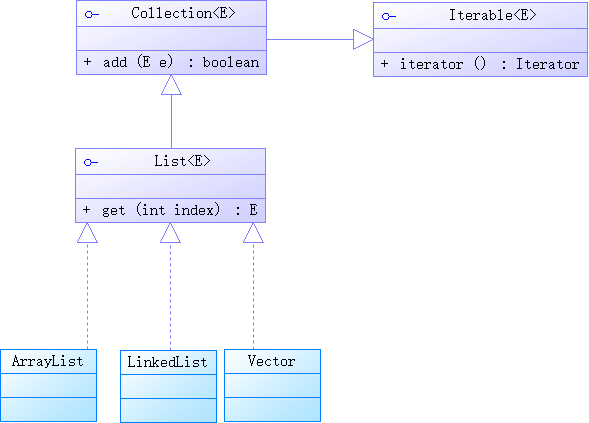

## 类集框架

### 类集简介（了解）

类集就是一组Java实现的数据结构。或者再简单一点，所谓的类集指的就是对象数组的应用。

在以前的例子中，要想保存多个对象，应该使用对象数组，但是传统的对象数组有一个问题：长度是固定的（数组一般不会使用）。后来使用链表来实现了一个动态的对象数组，但是对于链表的开发有几个问题：

* 链表的开发实在是太麻烦；
* 如果要考虑到链表的操作性能太麻烦；
* 链表使用了Object类进行保存，所有的对象必须发生向上以及强制性的向下转型。

综合以上的问题得出结论：如果在开发项目里面由用户自己去实现一个链表，那么这种项目的开发难度实在是太大了。并且在所有的项目里面都会存在有数据结构的应用，那么在Java设计之初就考虑到了此类问题，所以提供了一个与链表类似的工具类 —— Vector（向量），但是后来随着时间的推移，发现这个类并不能够很好的描述出数据结构这一概念，所以从Java 2（JDK 1.2之后）提供了一个专门实现数据结构的开发框架 —— 类集框架，并且在JDK 1.5之后，由于泛型技术的引入，有解决了类集框架之中所有的操作类型都使用Object所带来的安全隐患。

随后在JDK 1.8里面，又针对于类集的大数据的操作环境下推出了数据流的分析操作功能。

在整个类集里面一共有以下的几个核心接口：

* Collection、List、Set；
* Map；
* Iterator，Enumeration。

### Collection接口（重点）

Collection是整个类集之中单值保存的最大父接口。即：每一次可以向集合里面保存一个对象。首先来观察Collection接口的定义：

```java
public interface Collection<E>
extends Iterable<E>
```



在Collection接口里面定义有如下的几个常用操作方法。

| No. | 方法名称 | 类型 | 描述 |
| :---: | :---: | :---: | :---: |
| 1 | public boolean add(E e) | 普通 | 向集合里面保存数据 |
| 2 | public boolean addAll(Collection<? extends E> c) | 普通 | 追加一个集合 |
| 3 | public void clear() | 普通 | 清空集合 |
| 4 | public boolean contains(Object o) | 普通 | 判断是否包含有指定的内容 |
| 5 | public boolean isEmpty() | 普通 | 判断集合是否为空 |
| 6 | public boolean remove(Object o) | 普通 | 删除对象 |
| 7 | public int size() | 普通 | 取得集合中保存的元素个数 |
| 8 | public Object[] toArray() | 普通 | 将集合变为对象数组保存 |
| 9 | public Iterator<E> iterator() | 普通 | 为Iterator接口实例化 |

在所有的开发之中add()与iterator()两个方法的使用几率是最高的，其他的方法几乎可以忽略，但是你必须知道。需要注意的是，在使用contains()与remove()两个方法一定要依靠equals()支持。

按照以往对接口的使用，要想使用Collection接口就应该使用子类实例化这个接口。但是出于对程序严谨性的考虑，不会再直接使用Collection接口，而是使用它的两个子接口：List（允许重复）、Set（不允许重复）。

> **历史回顾：**
> 
> 最早Java刚刚推出类集框架的时候，使用最多的就是Collection接口，最大的使用环境就是在EJB上。于是在Java的一个开源项目（PetShop）上出现了问题。由于此项目是属于Java业余爱好者共同开发的，所以没有考虑到过多的性能问题以及代码或数据库的设计，就导致了整个程序的技术高端、性能过差，此时正赶上微软准备推出.net平台。微软使用.net重新设计并且开发了PetShop，对外宣布性能比Java好，于是事情的本质发生了改变，人们开始认为.net平台的性能很高，后来SUN的官方重新编写了PetShop，并且发布了测试报告，但是由于此时微软的宣传，所以基本上就已经变成了性能上的差距事实。
> 
> 因为代码的规范化的产生，所以从PetShop开始就不在使用模糊不清的Collection接口了，而都使用List或Set子接口进行开发。
