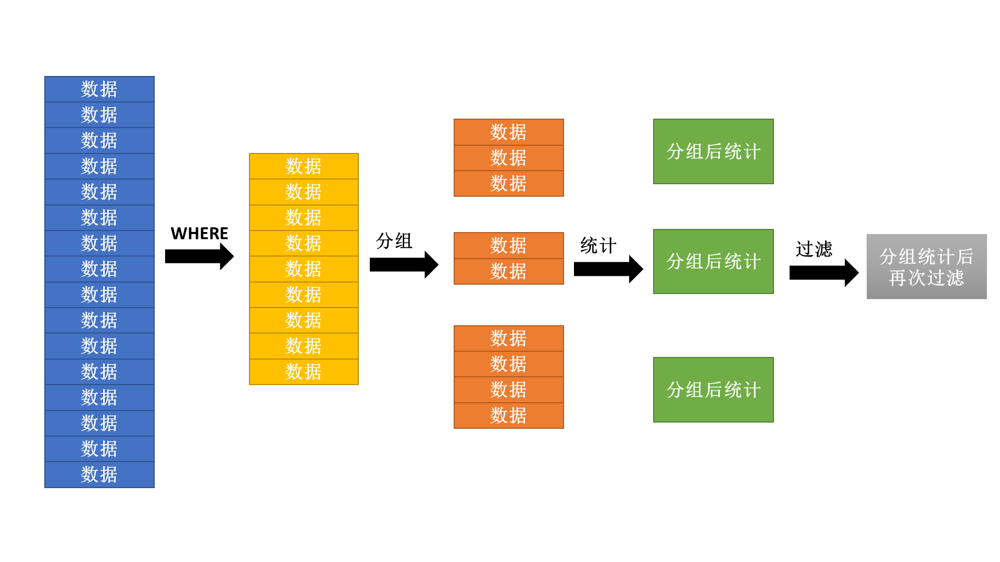

# 第 10 节 多表查询

分组统计查询其核心的问题就在于分组的处理上。要进行分组统计就需要考虑两个层次：统计操作、分组操作。

## 统计函数（分组函数、组函数）

在之前接触过一个COUNT\(\)函数，这个函数的主要作用是可以统计出数据表中的数据行的个数，这个本身就属于一个统计函数，而与之类似的还有SUM()、AVG()、MIN()、MAX()。

**范例：** 查询出公司的人数、平均工资、每月的总支出

```sql
SELECT COUNT(*),AVG(sal),SUM(sal) FROM emp;
```

**范例：** 查询出工资的最高和最低工资

```sql
SELECT MAX(sal),MIN(sal) FROM emp;
```

**范例：** 查询出公司的平均服务年限
  现在没有一个字段是明确表示出年限的，对于服务年限只能够通过计算得到。 

```sql
SELECT AVG(MONTHS_BETWEEN(SYSDATE,hiredate)/12) FROM emp;
```

**范例：** 查询公司的最早雇佣日期和最晚雇佣日期

```sql
SELECT MIN(hiredate),MAX(hiredate) FROM emp;
```

**注意：**对于统计函数而言，里面有一个最为常用的函数：COUNT()，所以对于COUNT()函数有如下说明:

* COUNT()函数的主要功能是统计记录个数，如果表中没有记录，则COUNT()统计结果是0，而不是null；
```sql
SELECT COUNT(*),AVG(sal) FROM bonus;
```
需要提示的是这个null和0只是在数据库层次上的显示，如果在程序的执行之中，null发现接收的类型是整数，自动变为0；
* 对于COUNT()函数有三种用法：COUNT(*)、COUNT(字段)、COUNT(DISTINCT 字段)
  * 如果要想统计出表的行数，最简单的罪罚是使用COUNT(*);
```sql
SELECT COUNT(*) FROM emp;
```
  * 如果现在某一个列上的数据没有null，那么使用COUNT(字段)和COUNT(*)的救国是相同的，如果有null，则null是不统计的；
```sql
SELECT COUNT(*),COUNT(empno) FROM emp;
SELECT COUNT(*),COUNT(mgr) FROM emp;
```
  * 如果现在某一个列上拥有重复的数据，统计的时候不想出现重复则使用DISTINCT处理；
```sql
SELECT COUNT(*),COUNT(DISTINCT job) FROM emp;
```

大部分情况下进行COUNT()统计的时候都会采用“COUNT(*)”的形式完成处理。

## 分组统计

要想进行分组可以使用GROUP BY子句，此时的SQL语法定义如下：

```sql
④SELECT [DISTINCT] 分组字段 | 统计函数 
①FROM 数据表1 [别名], 数据表2 [别名], ...
②[WHERE 过滤条件(s)]
③[GROUP BY 分组字段, 分组字段, ...]
⑤[ORDER BY 字段 [ASC | DESC], 字段 [ASC | DESC],...];
```

**范例：** 按照部门编号进行分组，查询出每个部门的人数、平均工资

```sql
SELECT deptno,COUNT(*),AVG(sal)
FROM emp
WHERE deptno IS NOT NULL
GROUP BY deptno;
```

**范例：** 统计每个职位的最低和最高工资

```sql
SELECT job,MAX(sal),MIN(sal)
FROM emp
GROUP BY job;
```

之所以选择deptno和job主要原因是因为这两个列上存在有重复的数据信息。

实现了分组虽然是一件看起来很容易的事情，但是对于分组操作之中是存在一些定义要求的；

1. 在编写查询语句时如果没有编写GROUP BY子句，则这个时候的SELECT子句之中只能够出现统计函数，表示对整表数据进行统计操作（整表分为一组）。
```
-- 错误的语句
SELECT ename,COUNT(*) FROM emp;
```
```sql
-- 正确的语句
SELECT COUNT(*) FROM emp;
```
2. 在使用GROUP BY查询之中，SELECT子句里面只能够出现分组字段和统计函数，其他的任何字段都不允许出现；
```
-- 错误的语句
SELECT ename,job,COUNT(*) FROM emp GROUP BY job;
```
```sql
-- 正确的语句
SELECT job,COUNT(*) FROM emp GROUP BY job;
```
3. 在进行分组查询的时候，统计函数允许嵌套，但是此时的SELECT子句之中不能够出现任何字段，包括分组字段。
```
-- 错误的语句
SELECT deptno,MAX(AVG(sal)) FROM emp GROUP BY deptno;
```
```sql
-- 正确的语句
SELECT MAX(AVG(sal)) FROM emp GROUP BY deptno;
```

对于统计查询而言，最麻烦的部分就是以上的几个定义。

## 多表查询与分组统计

在之前进行的分组统计都是采用了单表的形式完成的处理，于是下面希望乐意在多表查询上实现分组的统计处理操作。

**范例：** 查询出每个部门的名称、人数、平均工资

* 确定要使用的数据表：
  * dept表：部门名称；
  * emp表：得到统计信息；
* 确定已知的关联字段：
  * 雇员与部门：emp.deptno=dept.deptno；

**第一步：**转换需求，查询出每个部门名称、部门的雇员标号、雇员工资；

```sql
SELECT d.dname,e.empno,e.sal
FROM dept d,emp e
WHERE d.deptno=e.deptno;
```

**第二步：**这个时候发现dname字段上存在有重复的数据信息，按照分组的原则来讲，有重复就可以考虑分组；

```sql
SELECT d.dname,COUNT(*),AVG(sal)
FROM dept d,emp e
WHERE d.deptno=e.deptno
GROUP BY d.dname;
```

**第三步：**现在要求查处所有的部门，可是现在只显示出了三个部门，因为缺少外连接的控制。

```sql
SELECT d.dname,COUNT(empno),AVG(sal)
FROM dept d,emp e
WHERE d.deptno=e.deptno(+)
GROUP BY d.dname;
```

**范例：** 查询出每个工资等距对应的人数，以及此等级的最高工资

* 确定要使用的数据表：
  * salgrade表：等级的名称；
  * emp表：等级的信息统计；
* 确定已知的关联字段：
  * 雇员和工资等级：emp.sal BETWEEN salgrade.losal AND salgrade.hisal;

**第一步：**查询每个工资等级以及具备此等级的员工编号、工资。

```sql
SELECT s.grade,e.empno,e.sal
FROM salgrade s,emp e
WHERE e.sal BETWEEN s.losal AND s.hisal;
```

**第二步：**现在等级的列上出现有重复，所以可以进行分组统计

```sql
SELECT s.grade,COUNT(e.empno),MAX(e.sal)
FROM salgrade s,emp e
WHERE e.sal BETWEEN s.losal AND s.hisal
GROUP BY s.grade;
```

**范例：** 查询出每个部门的编号、名称、位置、部门人数、平均工资

* 确定要使用的数据表：
  * dept表：部门的编号、名称、位置；
  * emp表：雇员的信息统计；
* 确定已知的关联字段：
  * 部门与雇员：emp.deptno=dept.deptno。

**第一步：**查询出每个部门的编号、名称、位置、雇员编号、工资

```sql
SELECT d.deptno,d.dname,d.loc,e.empno,e.sal
FROM dept d,emp e
WHERE d.deptno=e.deptno(+);
```

**第二步：**现在可以发现是三个列一起重复，所以这个时候可以进行三个列的统一分组操作

```sql
SELECT d.deptno,d.dname,d.loc,COUNT(e.empno),AVG(e.sal)
FROM dept d,emp e
WHERE d.deptno=e.deptno(+)
GROUP BY d.deptno,d.dname,d.loc;
```

如果要想按照多个列分组，则要求：这多个列的内容一起重复着，这样的曹组往往都要结合多表查询一起出现。

## HAVING子句

在讲解HAVING具体做法之前，首先来看这样一个查询。

**范例：** 按照职位分组，查询出平均工资高于1200的所有职位信息以及该职位对应的人数、平均工资

```
SELECT job,COUNT(*),AVG(sal)
FROM emp
WHERE AVG(sal)>1200
GROUP BY job;
```

但是发现在执行时出现了错误信息：ORA-00934: 此处不允许使用分组函数。

**分析：**错误出现的原因？

* 按照SQL语法执行顺序来讲，先执行的是WHERE，在执行的分组，而后执行的是SELECT统计；
* 如果在WHERE里面使用统计函数，那么这是一个逻辑上的错误；



所以分组后进行的过滤统计是要求在HAVING子句中实现的，那么这个时候SQL语法如下：

```sql
⑤SELECT [DISTINCT] 分组字段 | 统计函数 
①FROM 数据表1 [别名], 数据表2 [别名], ...
②[WHERE 过滤条件(s)]
③[GROUP BY 分组字段, 分组字段, ...]
④[HAVING 分组后过滤]
⑥[ORDER BY 字段 [ASC | DESC], 字段 [ASC | DESC],...];
```

**范例：** 使用HAVING

```sql
SELECT job,COUNT(*),AVG(sal)
FROM emp
GROUP BY job
HAVING AVG(sal)>1200;
```

**总结：**HAVING与WHERE区别？

* WHERE：是在GROUP BY分组前使用，表示对要分组的数据进行筛选，不允许使用统计函数；
* HAVING：在GROUP BY之后使用，允许使用统计函数，针对分组后的数据进行筛选。

## 分组统计案例

现在已经清楚了整个基础的SQL操作，下面做两个简单的程序。

**案例一：**查询所有非销售人员的工资的总和，并且要求满足同一工作的雇员的工资总和大于5000，显示的结果按照工资的总和由高到低排序。

1. 查询所有不是销售的雇员，直接使用WHERE子句做过滤
```sql
SELECT * FROM emp WHERE job!='SALESMAN';
```
2. 查询所有非销售人员的工资的总和
```sql
SELECT job,SUM(sal)
FROM emp 
WHERE job!='SALESMAN'
GROUP BY job;
```
3. 同一工作的雇员的工资总和大于5000
```sql
SELECT job,SUM(sal)
FROM emp 
WHERE job!='SALESMAN'
GROUP BY job
HAVING SUM(sal)>5000;
```
4. 显示的结果按照工资的总和由高到低排序
```sql
SELECT job,SUM(sal) sum
FROM emp 
WHERE job!='SALESMAN'
GROUP BY job
HAVING SUM(sal)>5000
ORDER BY sum DESC;
```


**案例二：**统计出所有领取佣金和不领取佣金雇员人数、平均工资

* 此时最直接的做法就是按照佣金分组
```
SELECT comm,COUNT(*),AVG(sal)
FROM emp
GROUP BY comm;
```

这个时候会发现，不同的佣金变为了一组，不是所需要的结果。

* 统计出所有领取佣金的雇员人数、平均工资；
```sql
SELECT '领取佣金' info,COUNT(*),AVG(sal) FROM emp WHERE comm IS NOT NULL;
```
* 统计出不领取佣金的雇员人数、平均工资；
```sql
SELECT '领取佣金' info,COUNT(*),AVG(sal) FROM emp WHERE comm IS NULL;
```
* 发现以上的两个查询范湖的结果是相同的，使用联合将其关联
```sql
SELECT '领取佣金' info,COUNT(*),AVG(sal) FROM emp WHERE comm IS NOT NULL
	UNION
SELECT '不领取佣金' info,COUNT(*),AVG(sal) FROM emp WHERE comm IS NULL;
```

对于分组统计操作不一定只有GROUP BY可以解决，这些集合操作可以将多个查询结果整合在一起显示。
