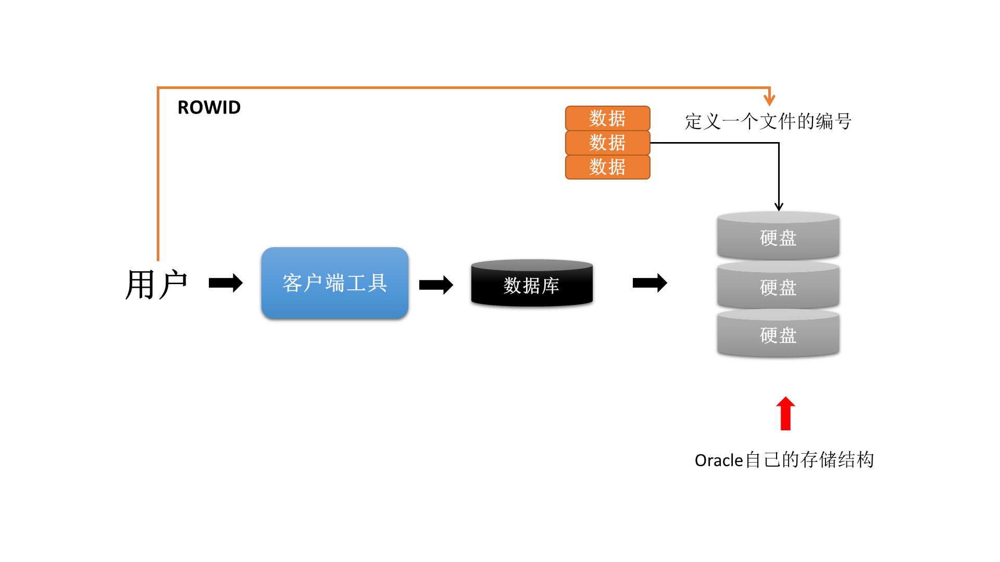

# 第 16 节 数据伪列

所谓的伪列指的就是不存在于表中的列，但是该列又可以直接使用。例如：之前接触到的SYSDATE就属于一个伪列，而在Oracle之中还有两个重量级的伪列：ROWNUM（开发中非常常用）、ROWID（数据库分析）。

## ROWNUM伪列

ROWNUM直译就是行号，在每一次查询的时候如果要想显示出当前的行号，就添加ROWNUM字段即可：

**范例：** 观察ROWNUM使用
```sql
SELECT ROWNUM,empno,ename FROM emp;
```

使用了ROWNUM之后会自动增加一个数据增长列，该行号由1开始，这个数值是根据查询出的结果生成的，并不是固定不变的。

在实际的开发之中ROWNUM可以做两件事情：
* 查询第一行记录：
* 查询前N行记录：

**范例：** 查询第一行数据
```sql
SELECT empno,ename FROM emp WHERE ROWNUM=1;
```

当接触到数据量较大的数据库时，通常会使用ROWNUM查看第一行记录以便了解大致情况。如果要查询全部数据，先使用COUNT()函数统计数据量，再进行查询操作。

ROWNUM还有另一个主要的作用就是可以进行前N行数据库的查询，这个时候需要使用“关系运算”进行控制。

**范例：** 查询emp表的前5行数据
```sql
SELECT ROWNUM,empno,ename FROM emp
WHERE ROWNUM<=5;
```

需要注意的是，ROWNUM只有查询前N行的能力，没有直接提供看中间行的能力。

ROWNUM本身不是固定的数据，而且它没有设置支持复杂判断的能力。所以这个时候如果要想实现部分数据的显示查看，就必须结合子查询一起使用。

### _**数据分页显示**_

所谓的分页显示值的是可以让表中的数据信息按照部分的模式来完成，例如：某个数据表中有1000W条数据，读取的时候只能够读取部分数据进行展示。这样的过程就成为分页显示，在Oracle里面，分页显示的基本定义语法形式如下：
```sql
SELECT * 
FROM (
    SELECT 查询字段,查询字段,...,ROWNUM rn
    FROM 数据表
    WHERE ROWNUM<=currentPage*lineSize) temp
WHERE temp.rn>(currentPage-1)*lineSize
```

其中currentPage描述的是当前所在页，而lineSize描述的每页显示的数据行数。

**范例：** 查询emp表中的6~10行记录
* currnetPage=2、lineSize=5
```sql
SELECT * 
FROM (
    SELECT empno,ename,job,ROWNUM rn
    FROM emp
    WHERE ROWNUM<=10) temp
WHERE temp.rn>5;
```

在今后的开发之中，数据的分页操作是一定会使用到的技术。

## ROWID

所谓的ROWID指的是数据行的唯一的编号，该编号是通过硬盘的存储而得来的。



**范例：** 观察ROWID组成
```sql
SELECT ROWID,deptno,dname,loc FROM dept;
```
```cmd
ROWID                  DEPTNO DNAME                        LOC
------------------ ---------- ---------------------------- --------------------------
AAAR3qAAEAAAACHAAA         10 ACCOUNTING                   NEW YORK
AAAR3qAAEAAAACHAAB         20 RESEARCH                     DALLAS
AAAR3qAAEAAAACHAAC         30 SALES                        CHICAGO
AAAR3qAAEAAAACHAAD         40 OPERATIONS                   BOSTON
```

每一行记录都有唯一的一个ROWID的数据，而且可以通过ROWID定位数据行。

**范例：** 通过ROWID找到数据
```sql
SELECT * FROM dept WHERE ROWID='AAAR3qAAEAAAACHAAB';
```

对于任何一个ROWID其基本组成结构吐下：'AAAR3qAAEAAAACHAAB'
* 数据的对象编号：AAAR3q；
* 数据保存的文件编号：AAE；
* 数据保存的文件块编号：AAAACH；
* 数据保存的行号：AAA；

## ROWID面试题

**要求：**现在有一张数据表，但是由于该数据表在设计初期没有设计到尾，导致了在数据表之中存在有大量的完全重复数据，现在要求删除里面的重复数据（重复数据保留一条），如何实现？

> 复现问题
> 
> 1. 将dept表的内容复制为mydept表：
> ```sql
> CREATE TABLE mydept AS SELECT * FROM dept;
> ```
> 2. 查看当前的mydept表的内容：
> ```sql
> SELECT ROWID,deptno,dname,loc FROM mydept;
> ```
> 3. 向mydept表中追加一些重复的数据：
> ```sql
> INSERT INTO mydept (deptno,dname,loc) VALUES (20,'RESEARCH','DALLAS');
> INSERT INTO mydept (deptno,dname,loc) VALUES (20,'RESEARCH','DALLAS');
> INSERT INTO mydept (deptno,dname,loc) VALUES (30,'SALES','CHICAGO');
> ```

* 首先应查询出所有应该被保留的数据
```sql
SELECT deptno,dname,loc,MIN(ROWID)
FROM mydept
GROUP BY deptno,dname,loc;
```
* 删除以上查询以外的所有数据
```sql
DELETE FROM mydept 
WHERE ROWID NOT IN (
    SELECT MIN(ROWID)
    FROM mydept
    GROUP BY deptno,dname,loc);
```
