# 第 2 节 Oracle安装与配置

---

Oracle用作个人用途时是免费的，但是如果用作商业用途则要收费。

Oracle的内容主要分为两大部分：开发部分、管理部分，本次讲解重点在开发部分。

要想获取Oracle数据库的安装程序可通过Oracle官网：[www.oracle.com](https://www.oracle.com/database/products.html)进行下载，下载时注意检查所下载的Oracle操作系统版本：32位或64位。

下面以**Oracle 11g**安装为例：

Windows x64平台下获得的Oracle 11g安装包有两个：

* win64_11gR2_database_1of2.zip
* win64_11gR2_database_2of2.zip

在使用时需要将两个文件同时解压，解压为一个_database_文件夹。安装时有以下几点需要注意：

* 关闭本机防火墙；
* 尽可能断开互联网；

直接执行database下的“setup.exe”即可。

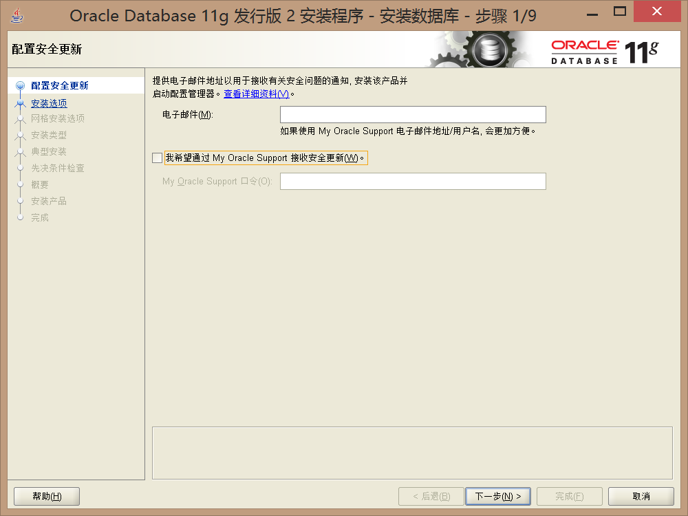

首先会询问用户是否接受Oracle的更新信息。

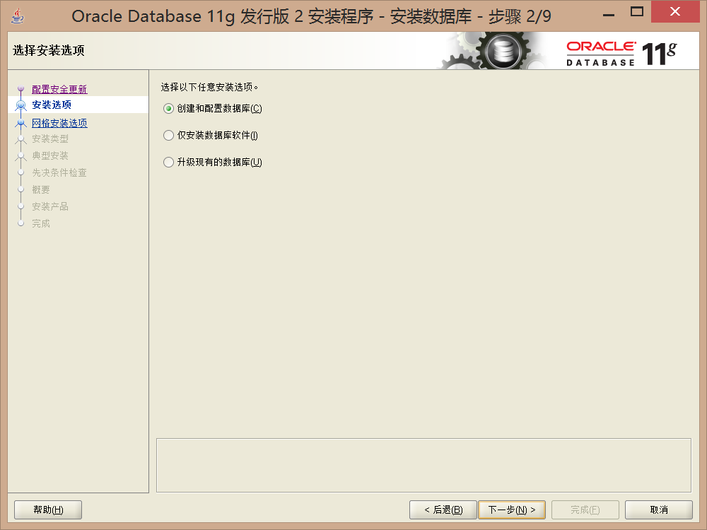

Oracle本身只是一个软件平台，在Oracle平台安装完成之后需要为其配置数据库，所以此处会询问是否要创建新的数据库。

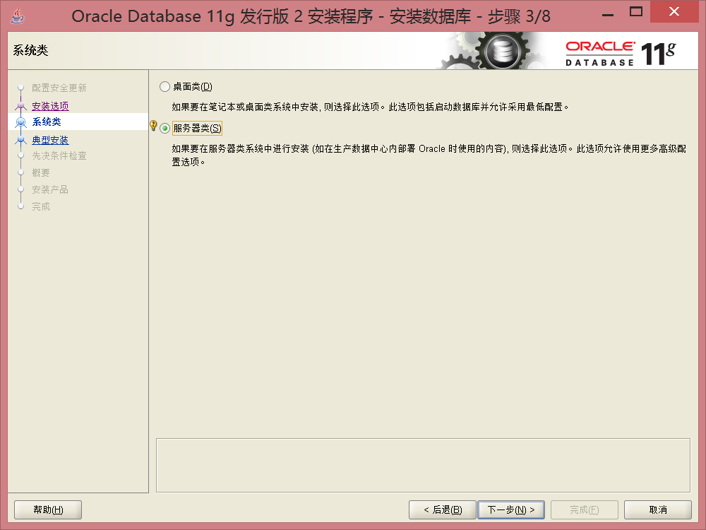

本次不牵扯到Oracle中的RAC管理（AIX + Oracle配置）。

为了方便配置，在安装的时候选择高级安装。

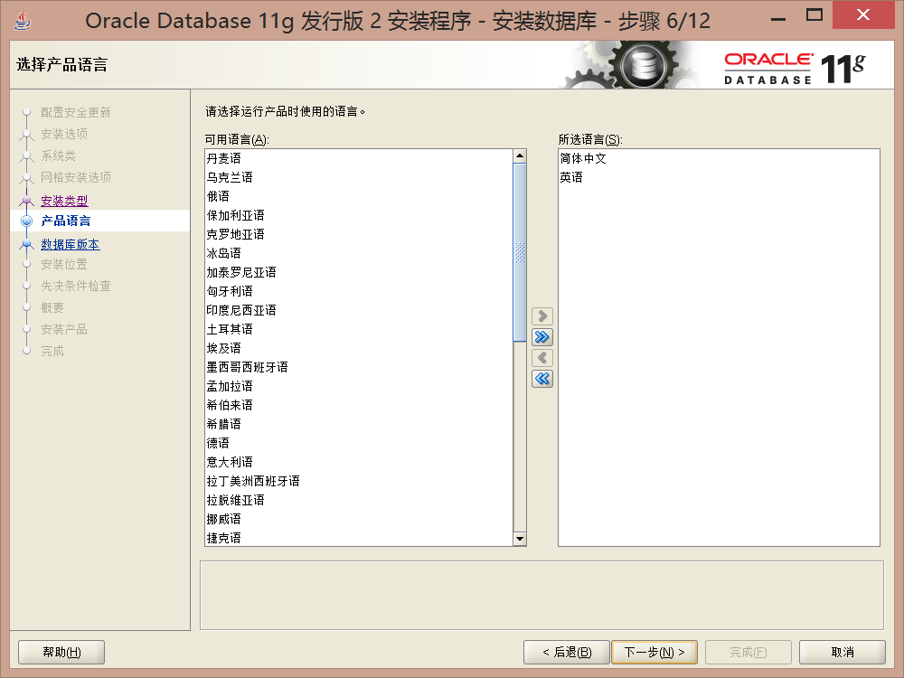

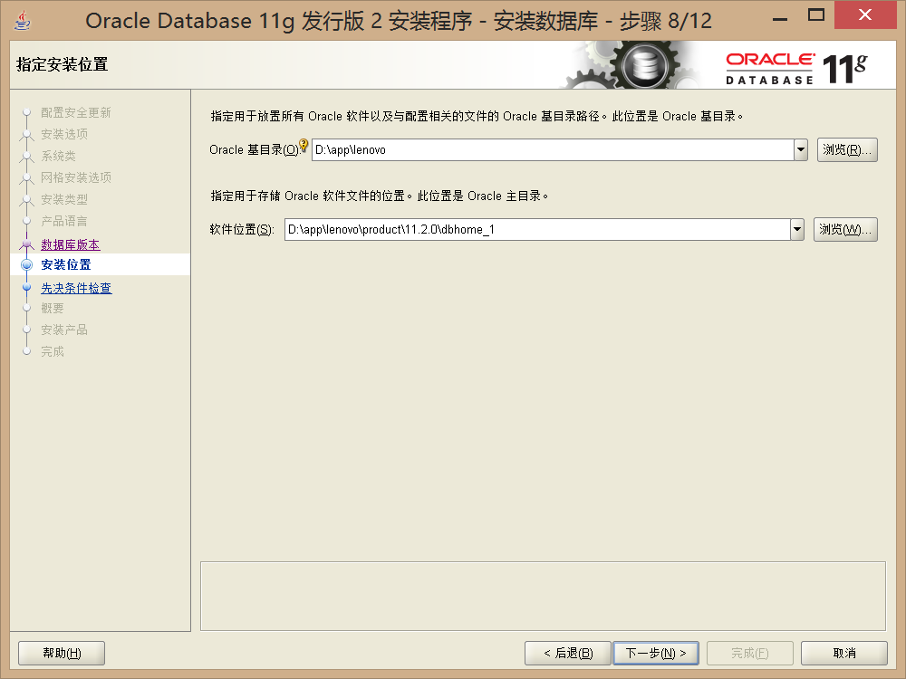

此处将Oracle安装在D盘下：D:\app\lenovo\product\11.2.0\dbhome_1

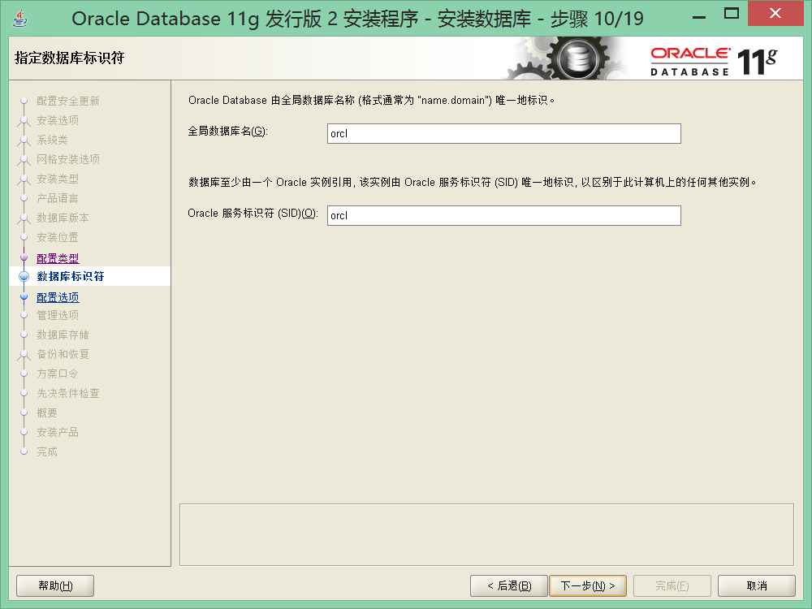

此处默认即可，也可自行设置数据库名。

_**将字符编码设为UTF-8编码。**_

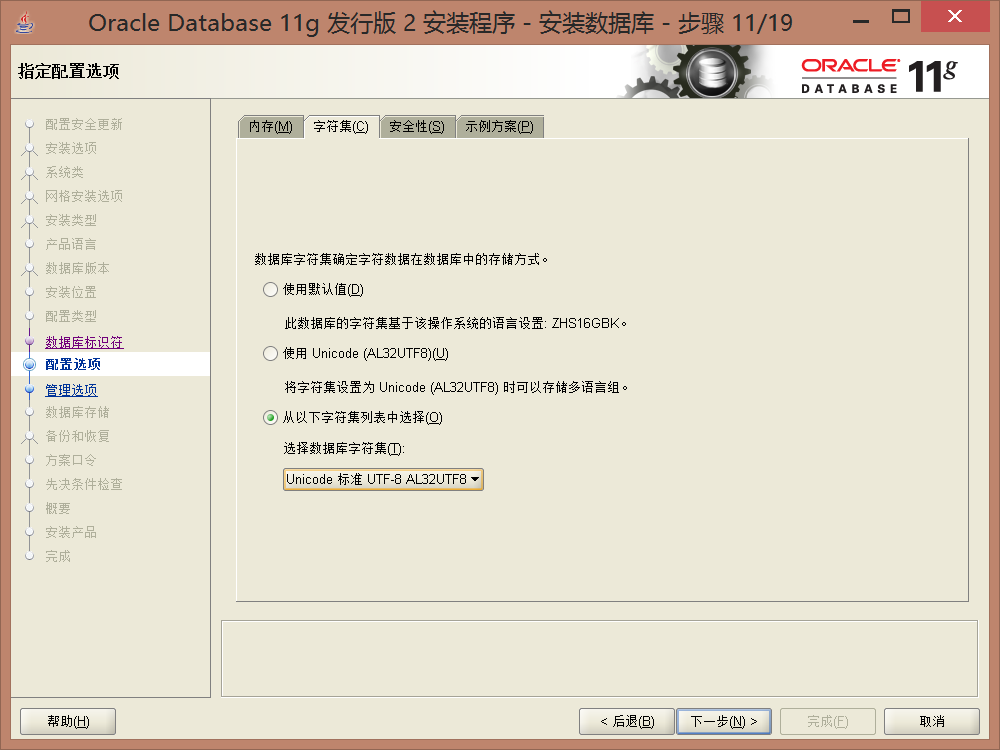

考虑到之后学习方便，创建所有的示例数据。

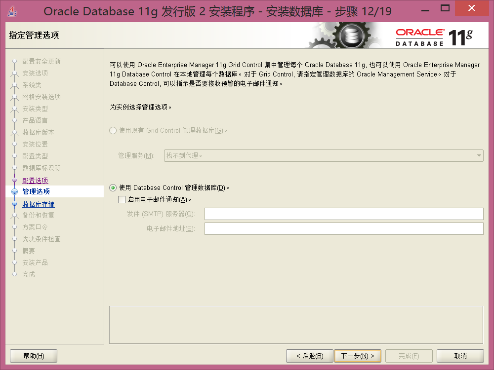

为了方便管理统一将所有用户的密码设置为“oracleadmin”（全部小写，不过这个拼写不属于Oracle的命名标准）。

标准：大小写字母及数字构成，但是这个标准比较麻烦。

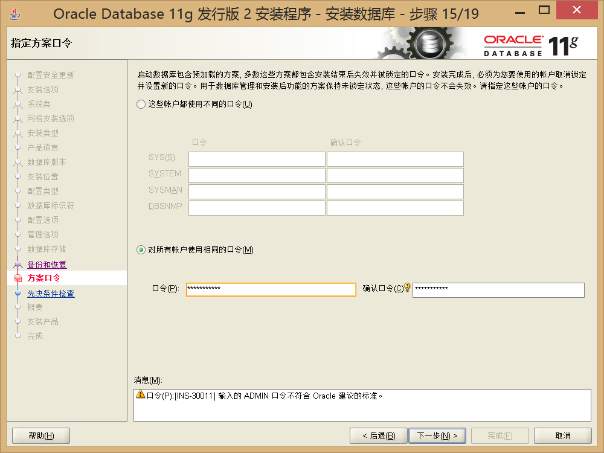

如果检查出现了一些错误提示，直接选择忽略即可。

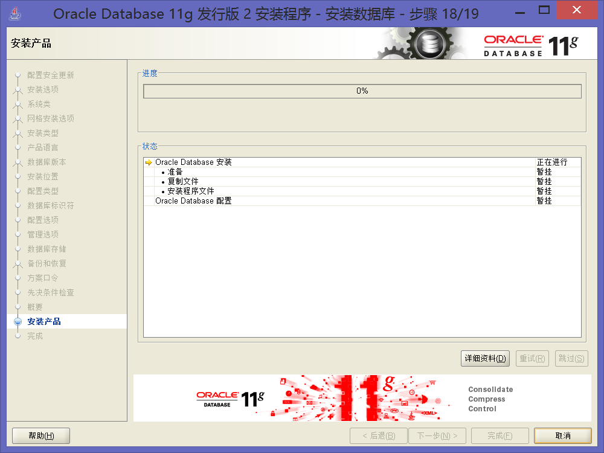

随后开始启动Oracle的安装程序。

程序会自动创建数据库，但是每一个数据库都需要进行额外的配置。

随后使用口令管理程序。主要操作以下的几个用户（设置经典口令）：

* 超级管理员：sys / change_on_install；
* 普通管理员：system / manager；
* 普通用户[^1]：scott / tiger，解锁；
* 大数据用户（样本数据库才有）：sh / sh，解锁。

这个时候才表示Oracle软件安装完成，数据库也安装完成。

在Oracle安装的过程中会再Windows中注册一些服务：

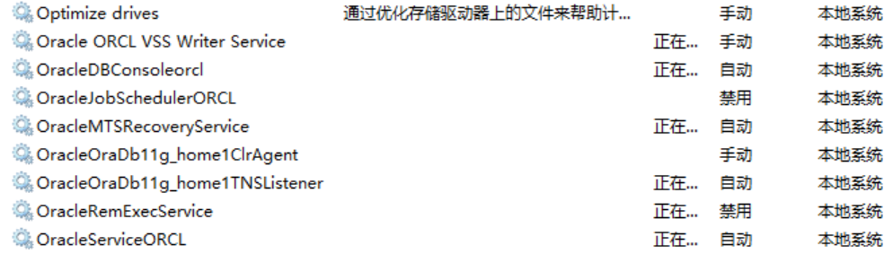

在安装完Oracle之后，Oracle的相关服务都会设置为自动启动，但是这样一来，对于电脑的启动速度实在是太慢了，所以强烈建议将所有的服务设置为手动启动。

而每次启动的时候只需要启动两个服务即可：

* OracleOraDb11g_home1TNSListener：监听服务，如果要通过程序或不同的客户端连接Oracle数据库的时候此服务必须启动，否则无法连接；
* OracleServiceORCL：数据库实例服务，它的命名标准：OracleServiceSID，每当系统增加一个数据库的时候，都会增加一个类似的服务。
  * 在默认的情况下，SID的名称和数据库的名称是完全一致的，在网络上使用的是SID的名字。

---

[^1]: Oracle创始人中有一位叫Bruce Scott，他养了一只猫叫做tiger。

