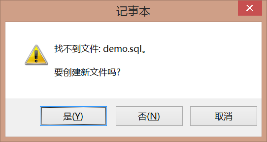

# 第 3 节 SQLPlus命令

---

Oracle提供的是一个软件平台，如果想要使用这个平台，直接运行命令即可（可以使用图形界面操作，但是不建议使用），sqlplus是执行oracle命令的主要指令。

Oracle安装完成之后会自动提供一个sqlplus命令，直接运行此命令即可。随后要求输入用户名与密码（密码不回显）。除了这种方法之外，也可以直接启动命令行模式（运行cmd），输入命令：

```bash
sqlplus scott/tiger
```

数据库之中基本组成是数据表，每一张表会包含有多条数据记录，下面查询emp表的数据。

```sql
SELECT * FROM emp;
```

执行之后会发现显示的格式是比较混乱的，原因是此时没有设置环境：

* 设置每行显示的数据长度：SET LINESIZE 300；
  * 因为此显示会受到命令行的限制。
* 设置每页显示的数据行数：SET PAGESIZE 30；

这两个指令称为格式化指令。

现在使用的是Windows操作系统，Windows系统在进行一些命令编辑的时候都很好使用。但是很多的Oracle运行的时候都是没有图形界面的，所以一般这样的情况下要想编写程序代码，那么就必须启动本地的记事本程序。

命令：“ed 文件名称”（如果不写猴嘴，默认的后缀就是*.sql），输入：ed demo；



打开记事本之后，就相当于进入到了一种程序阻塞状态，必须等待记事本关闭之后才可以继续使用。

随后要想执行文件中的命令，使用“@文件名称”（默认找到*.sql的后缀），例如“@demo”；

在整个Oracle里面提供有四个用户，可以直接在sqlplus中使用如下的语法切换用户，语法：

```
CONN 用户名/密码 [AS SYSDBA]
```

如果现在使用的是sys用户登录，那么必须要写上“AS SYSDBA”，否则无法登录。

**范例：** 使用system登录

```sql
CONN system/manager
```

**范例：** 使用sys登录

```sql
CONN sys/change_on_install AS SYSDBA
```

之前执行了查询emp表数据的操作，现在在sys用户下，执行同样的命令。

```sql
SELECT * FROM emp
              *
第 1 行出现错误:
ORA-00942: 表或视图不存在
```

因为emp表述语scott用户。严格来讲emp表的名称是“模式名称.表名称”（后来随着发展，模式名称就几乎等同于用户名，所以emp表的完整名称是“用户名.表名称”，即：“scott.emp”）。

**范例：** 使用完整的名称访问

```
SELECT * FROM scott.emp;
```

在sqlplus命令里面，除了可以使用Oracle自己定义的命令之外，也可以利用HOST指令调用本机的操作系统命令。

**范例：** 调用echo命令

```
echo helloworld
```

```
HOST echo helloworld
```

**范例：** 调用copy命令

```
copy 源文件路径 目标文件路径
```

```
copy d:\demo.zip d:hello.zip
```

```
HOST copy d:\demo.zip d:hello.zip
```


## 总结


1、格式化命令：
  * 设置每行的长度：SET LINESIZE 长度；
  * 设置每页的长度：SET PAGESIZE 长度；

2、切换用户：
  * CONN 用户名/密码 [AS SYSDBA]，如果是sys用户一定要写行SYSDBA；

3、调用本机命令：HOST作为前缀。
