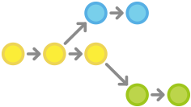
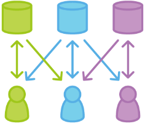
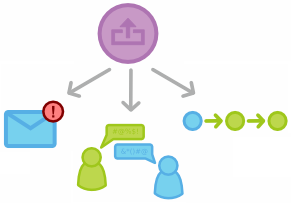

# Git

- Git 是一个开源的分布式版本控制系统，用于敏捷高效地处理任何或小或大的项目。
- Git 是 Linus Torvalds 为了帮助管理 Linux 内核开发而开发的一个开放源码的版本控制软件。
- Git 与常用的版本控制工具 CVS, Subversion 等不同，它采用了分布式版本库的方式，不必服务器端软件支持。

## 安装 Git

Linux 和 MacOS 在系统中都集成有 git，Windows 用户可以在[https://git-scm.com/downloads](https://git-scm.com/downloads)进行下载。

## Git 工作流

工作流有各式各样的用法，但也正因此使得在实际工作中如何上手使用增加了难度。这篇指南通过总览公司团队中最常用的几种 Git 工作流让大家可以上手使用。

在阅读的过程中请记住，本文中的几种工作流是作为方案指导而不是条例规定。在展示了各种工作流可能的用法后，你可以从不同的工作流中挑选或揉合出一个满足你自己需求的工作流。

### 集中式工作流

如果你的开发团队成员已经很熟悉 Subversion，集中式工作流让你无需去适应一个全新流程就可以体验 Git 带来的收益。这个工作流也可以作为向更 Git 风格工作流迁移的友好过渡。

### 功能分支工作流

功能分支工作流以集中式工作流为基础，不同的是为各个新功能分配一个专门的分支来开发。这样可以在把新功能集成到正式项目前，用 `Pull Requests` 的方式讨论变更。

### GitFlow 工作流

GitFlow 工作流通过为功能开发、发布准备和维护分配独立的分支，让发布迭代过程更流畅。严格的分支模型也为大型项目提供了一些非常必要的结构。

### Forking 工作流

Forking 工作流是分布式工作流，充分利用了 Git 在分支和克隆上的优势。可以安全可靠地管理大团队的开发者（developer），并能接受不信任贡献者（contributor）的提交。

### Pull Requests

Pull requests 让开发者更方便地进行协作的功能，提供了友好的 Web 界面可以在提议的修改合并到正式项目之前对修改进行讨论。

