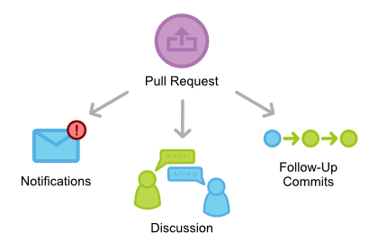
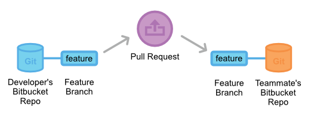
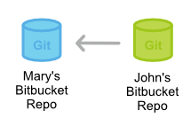
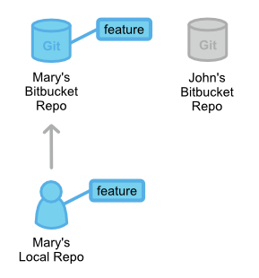
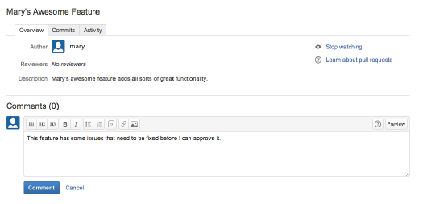

# Pull Requests

Pull Requests 是 Bitbucket 上方便开发者之间协作的功能。提供了一个用户友好的 Web 界面，在集成提交的变更到正式项目前可以对变更进行讨论。


开发者向团队成员通知功能开发已经完成，Pull Requests 是最简单的用法。开发者完成功能开发后，通过 Bitbucket 账号发起一个 Pull Request。这样让涉及这个功能的所有人知道，要去做 Code Review 和合并到 master 分支。

但是，Pull Request 远不止一个简单的通知，而是为讨论提交的功能的一个专门论坛。如果变更有任何问题，团队成员反馈在 Pull Request 中，甚至 push 新的提交微调功能。所有的这些活动都直接跟踪在 Pull Request 中。



相比其它的协作模型，这种分享提交的形式有助于打造一个更流畅的工作流。SVN 和 Git 都能通过一个简单的脚本收到通知邮件；但是，讨论变更时，开发者通常只能去回复邮件。这样做会变得杂乱，尤其还要涉及后面的几个提交时。Pull Requests 把所有相关功能整合到一个和 Bitbucket 仓库界面集成的用户友好 Web 界面中。

## 解析 Pull Request

当要发起一个 Pull Request，你所要做的就是请求（Request）另一个开发者（比如项目的维护者），来 pull 你仓库中一个分支到他的仓库中。这意味着你要提供 4 个信息（源仓库、源分支、目的仓库、目的分支），以发起 Pull Request。


## 工作方式

Pull Request 可以和功能分支工作流、GitFlow 工作流或 Forking 工作流一起使用。但 Pull Request 要求要么分支不同，要么仓库不同，所以不能用于集中式工作流。在不同的工作流中使用 Pull Request 会有一些不同，但基本的过程是这样的：

- 开发者在本地仓库中新建一个专门的分支开发功能。
- 开发者 push 分支修改到公开的 Bitbucket 仓库中。
- 开发者通过 Bitbucket 发起一个 Pull Request。
- 团队的其它成员 review code，讨论并修改。
- 项目维护者合并功能到官方仓库中并关闭 Pull Request。

### 在功能分支工作流中使用 Pull Request

功能分支工作流用一个共享的 Bitbucket 仓库来管理协作，开发者在专门的分支上开发功能。但不是立即合并到 master 分支上，而是在合并到主代码库之前开发者应该开一个 Pull Request 发起功能的讨论。


功能分支工作流只有一个公开的仓库，所以 Pull Request 的目的仓库和源仓库总是同一个。通常开发者会指定他的功能分支作为源分支，master 分支作为目的分支。

收到 Pull Request 后，项目维护者要决定如何做。如果功能没问题，就简单地合并到 master 分支，关闭 Pull Request。但如果提交的变更有问题，他可以在 Pull Request 中反馈。之后新加的提交也会评论之后接着显示出来

在功能还没有完全开发完的时候，也可能发起一个 Pull Request。比如开发者在实现某个需求时碰到了麻烦，他可以发一个包含正在进行中工作的 Pull Request。其它的开发者可以在 Pull Request 提供建议，或者甚至直接添加提交来解决问题。

### 在 GitFlow 工作流中使用 Pull Request

GitFlow 工作流和功能分支工作流类似，但围绕项目发布定义一个严格的分支模型。在 GitFlow 工作流中使用 Pull Request 让开发者在发布分支或是维护分支上工作时，可以有个方便的地方对关于发布分支或是维护分支的问题进行交流。


GitFlow 工作流中 Pull Request 的使用过程和上一节中完全一致：当一个功能、发布或是热修复分支需要 Review 时，开发者简单发起一个 Pull Request，团队的其它成员会通过 Bitbucket 收到通知。

新功能一般合并到 develop 分支，而发布和热修复则要同时合并到 develop 分支和 master 分支上。Pull Request 可能用做所有合并的正式管理。

### 在 Forking 工作流中使用 Pull Request

在 Forking 工作流中，开发者 push 完成的功能到他自己的仓库中，而不是共享仓库。然后，他发起一个 Pull Request，让项目维护者知道他的功能已经可以 Review 了。

在这个工作流，Pull Request 的通知功能非常有用，因为项目维护者不可能知道其它开发者在他们自己的仓库添加了提交


由于各个开发有自己的公开仓库，Pull Request 的源仓库和目标仓库不是同一个。源仓库是开发者的公开仓库，源分支是包含了修改的分支。如果开发者要合并修改到正式代码库中，那么目标仓库是正式仓库，目标分支是 master 分支。

Pull Request 也可以用于正式项目之外的其它开发者之间的协作。比如，如果一个开发者和一个团队成员一起开发一个功能，他们可以发起一个 Pull Request，用团队成员的 Bitbucket 仓库作为目标，而不是正式项目的仓库。然后使用相同的功能分支作为源和目标分支。



2 个开发者之间可以在 Pull Request 中讨论和开发功能。完成开发后，他们可以发起另一个 Pull Request，请求合并功能到正式的 master 分支。在 Forking 工作流中，这样的灵活性让 Pull Request 成为一个强有力的协作工具。

## 示例

下面的示例演示了 Pull Request 如何在在 Forking 工作流中使用。也同样适用于小团队的开发协作和第三方开发者向开源项目的贡献。

在示例中，小红是个开发，小明是项目维护者。他们各自有一个公开的 Bitbucket 仓库，而小明的仓库包含了正式工程。

### 小红 fork 正式项目



小红先要 fork 小明的 Bitbucket 仓库，开始项目的开发。她登陆 Bitbucket，浏览到小明的仓库页面，点 Fork 按钮。


然后为 fork 出来的仓库填写名字和描述，这样小红就有了服务端的项目拷贝了。

### 小红克隆她的 Bitbucket 仓库


下一步，小红克隆自己刚才 fork 出来的 Bitbucket 仓库，以在本机上准备出工作拷贝。命令如下：

```bash
git clone https://user@bitbucket.org/user/repo.git
```

请记住，`git clone` 会自动创建 origin 远程别名，是指向小红 fork 出来的仓库。

### 小红开发新功能

在开始改代码前，小红要为新功能先新建一个新分支。她会用这个分支作为 Pull Request 的源分支。

```bash
git checkout -b some-feature
```

## 编辑代码

```bash
git commit -a -m "Add first draft of some feature"
```

在新功能分支上，小红按需要添加提交。甚至如果小红觉得功能分支上的提交历史太乱了，她可以用交互式 rebase 来删除或压制提交。对于大型项目，整理功能分支的历史可以让项目维护者更容易看出在 Pull Request 中做了什么内容。

### 小红 push 功能到她的 Bitbucket 仓库中



小红完成了功能后，push 功能到她自己的 Bitbucket 仓库中（不是正式仓库），用下面简单的命令：

```bash
git push origin some-branch
```

这时她的变更可以让项目维护者看到了（或者任何想要看的协作者）。

### 小红发起 Pull Request


Bitbucket 上有了她的功能分支后，小红可以用她的 Bitbucket 账号浏览到她的 fork 出来的仓库页面，点右上角的【Pull Request】按钮，发起一个 Pull Request。弹出的表单自动设置小红的仓库为源仓库，询问小红以指定源分支、目标仓库和目标分支。

小红想要合并功能到正式仓库，所以源分支是她的功能分支，目标仓库是小明的公开仓库，而目标分支是 master 分支。另外，小红需要提供 Pull Request 的标题和描述信息。如果需要小明以外的人审核批准代码，她可以把这些人填在【Reviewers】文本框中。


创建好了 Pull Request，通知会通过Bitbucket系统消息或邮件（可选）发给小明。

### 小明 review Pull Request


在小明的 Bitbucket 仓库页面的 【Pull Request】Tab 可以看到所有人发起的 Pull Request。点击小红的 Pull Request 会显示出 Pull Request 的描述、功能的提交历史和每个变更的差异（diff）。

如果小明想要合并到项目中，只要点一下【Merge】按钮，就可以同意 Pull Request 并合并到 master 分支。

但如果像这个示例中一样小明发现了在小红的代码中的一个小 Bug，要小红在合并前修复。小明可以在整个 Pull Request 上加上评注，或是选择历史中的某个提交加上评注。



### 小红补加提交

如果小红对反馈有任何疑问，可以在 Pull Request 中响应，把 Pull Request 当作是她功能讨论的论坛。

小红在她的功能分支新加提交以解决代码问题，并 push 到她的 Bitbucket 仓库中，就像前一轮中的做法一样。这些提交会进入的 Pull Request，小明在原来的评注旁边可以再次 review 变更。

### 小明接受 Pull Request

最终，小明接受变更，合并功能分支到 master 分支，并关闭 Pull Request。至此，功能集成到项目中，其它的项目开发者可以用标准的 git pull 命令 pull 这些变更到自己的本地仓库中。

## 总结

到了这里，你应该有了所有需要的工具来集成 Pull Request 到你自己的工作流。请记住，Pull Request 并不是为了替代任何基于 Git 的协作工作流，而是它们的一个便利的补充，让团队成员间的协作更轻松方便。